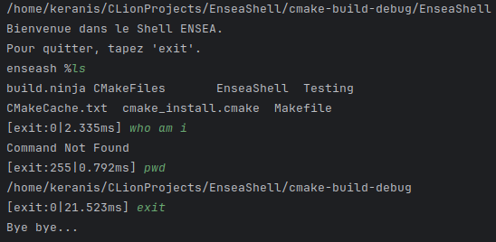
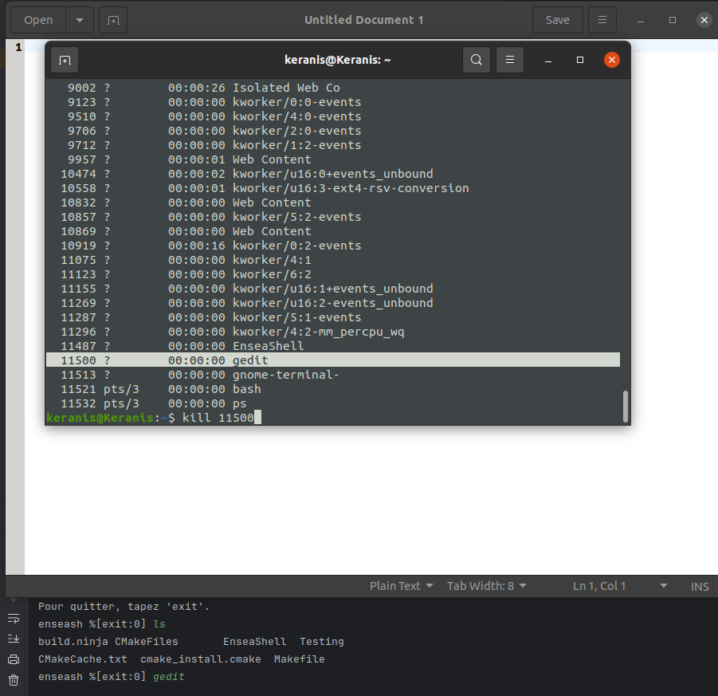
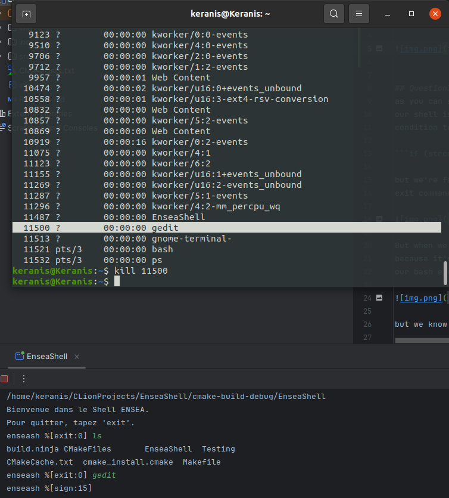
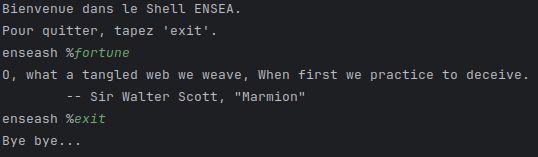
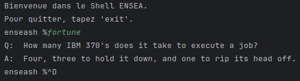
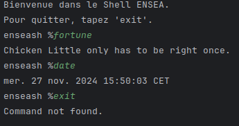
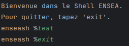

# Synthesys Practical Work Ensea in the Shell

## Question 5

Now to calculate the execution time for a process, we save the time before
creating the new process and we save the finishing time after the wait of that
process. And then we do the calculation and we print it.




## Question 4

Now to capture signals, we've tested this example, 
we run gedit which is continuous process, and then we've 
located its PID from a new terminal by writing ```ps -e``` command

Then we've sent a signal to this process gedit and the signal is kill
which has a signal code 15 so either we send kill or kill -15 the same 
result we'll get.



After hitting the enter button, we can see that we've captured the signal 15



## Question3
as you can see from the previous question, when we write exit, 
our shell is printing command not found, so we added a verification
condition to verify is the command is not exit :

```if (strcmp(inputBuffer, EXIT_KEY_WORD) != 0 && fork() == CHILD_SELF_PID) {```

but we're facing a little problem, when we execute the code and write 
exit command it shows the correct behaviour like this 



But when we press the <CTRL-D> command, it's not going on, maybe 
because it's interrupted by the process who executed our bash, before
our bash execute it.



but we know we should put the displaying of the message here in the main when interrogating commands!

```
if (!read_input(inputBuffer, BUFSIZE)) {
            display_message(FAREWELL_MSG);
            break;
        }
```

or here in the read_input function in the io.c file: 

```
int read_input(char *buffer, size_t size) {
    ssize_t bytesRead = read(STDIN_FILENO, buffer, size - 1);
    if (bytesRead > 0) {
        buffer[bytesRead - 1] = '\0';
        return 1;
    }
    display_message(FAREWELL_MSG);
    return 0;
}
```

## Question2 

When we execute the code: 
we got this behaviour ! 




## Question 1
When we execute the code : 
and write anything always getting the same ouput




BY ELLOUMI Molka & HADJ SASSI Mahdi